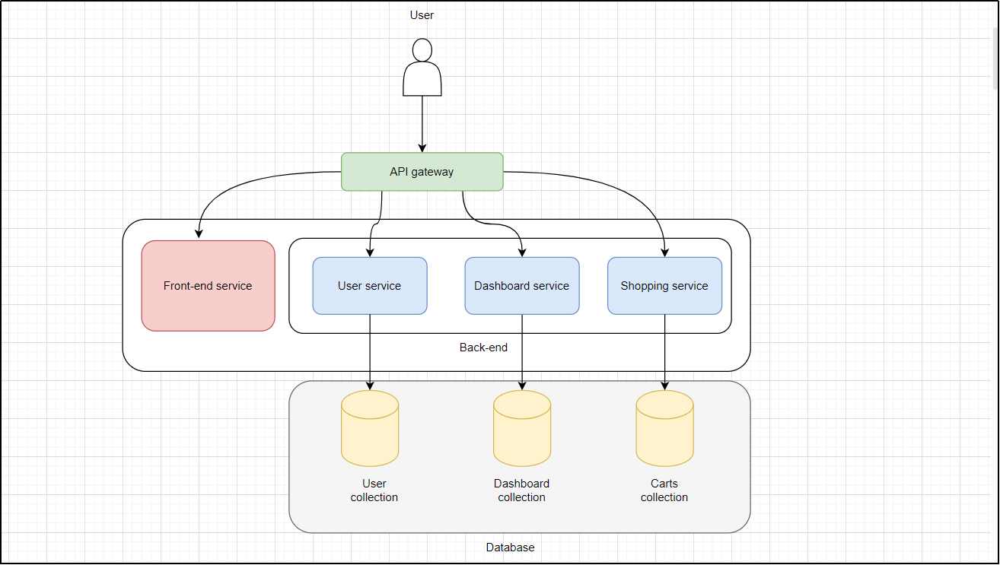
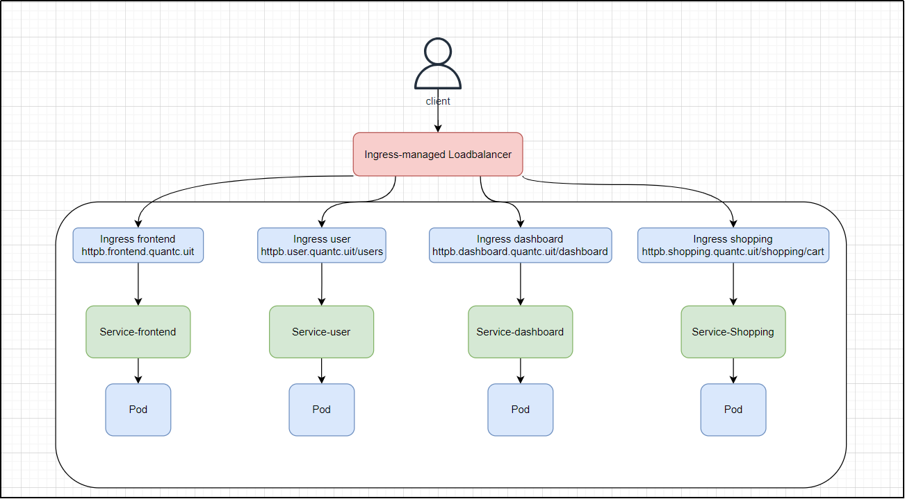

# Deploy a microservice application on Kubernetes in an on-premise environment

## 1. Tóm tắt
Đề tài tập trung triển khai một ứng dụng microservice trên nền tảng Kubernetes
trong môi trường on-premise. Trước hết, nhóm tìm hiểu tổng quan về Kubernetes
và microservices, bao gồm kiến trúc, chức năng, cũng như so sánh với các giải
pháp khác như Docker Swarm và Monolithic. Sau đó, nhóm tiến hành cài đặt cụm
Kubernetes từ các bước chuẩn bị server, cấu hình mạng, cài đặt các thành phần cơ
bản như containerd, kubeadm, kubectl. Công cụ quản lý Rancher được sử dụng để
đơn giản hóa việc quản lý cụm. Nhóm cũng triển khai Ingress controller để định
tuyến truy cập và sử dụng Nginx làm Load Balancer. Cuối cùng, ứng dụng
microservices được đóng gói, đẩy lên Docker Hub và triển khai thành công trên
hệ thống Kubernetes đã xây dựng. 
## 2. Mô hình triển khai
#### Hình bên dưới là kiến trúc của ứng dụng Microservice. Cụ thể sẽ có link trong file PDF

#### Mô hình triển khai sẽ gồm 3 máy ảo. Một máy đóng vai trò là Control-plane (master), còn 2 máy sẽ đóng vai trò là worker. Hình dưới là luồng hoạt động khi triển khai ứng dụng

### Kịch bản thực hiện: ###
- Triển khai ứng dụng microservice trên K8s (Demo các dịch vụ user, dashboard, shopping cart)
- Huỷ một service và kiểm tra sự hoạt động của các service còn lại
- Sử dụng configmap và secret để thay đổi hostname
- Thực hiện autoscaling
## 3. Triển khai
Nội dung triển khai, các bước thực hiện được nằm trong file PDF
## 4. Kết luận
Qua quá trình thực hiện đề tài, nhóm đã có cơ hội tiếp cận thực tế với việc triển
khai và vận hành hệ thống Kubernetes trong môi trường on-premise. Từ việc xây
dựng cụm K8s, cài đặt công cụ quản lý Rancher, cấu hình Ingress, cho đến việc
triển khai ứng dụng microservice, mỗi bước đều giúp nhóm hiểu sâu hơn về cách
hoạt động của các thành phần. Mặc dù gặp phải một số khó khăn như lỗi cấu hình
hay các vấn đề tương thích giữa các phiên bản phần mềm, nhưng thông qua việc
tìm hiểu và khắc phục, nhóm đã rèn luyện được kỹ năng giải quyết vấn đề và tư
duy hệ thống. Đây là nền tảng tốt để nhóm có thể ứng dụng vào các dự án thực tế
trong tương lai. Nhóm cũng nhận thấy tầm quan trọng của việc chuẩn hóa quy
trình triển khai và tối ưu tài nguyên trong hệ thống phân tán.
> Nội dung được thực hiện bởi nhóm 6 - Nhóm trưởng: Tô Công Quân
